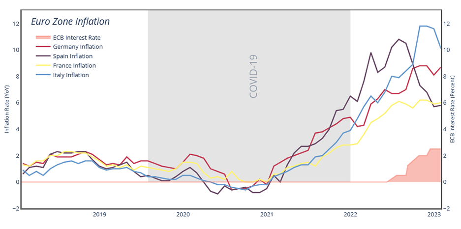

# Euro Zone Inflation Outlook (Feb 2023)
This is a graph illustrating euro zone inflation and ECB interest rates circa February 2023, originally published on Geopoliticalmonitor.com. Raw data is formatted in CSV from Tradingeconomics.com.

Output: 

